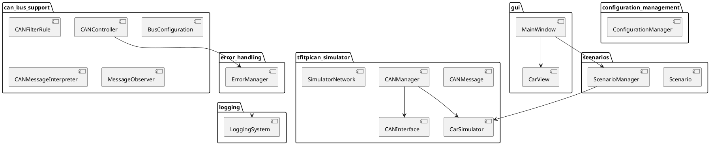
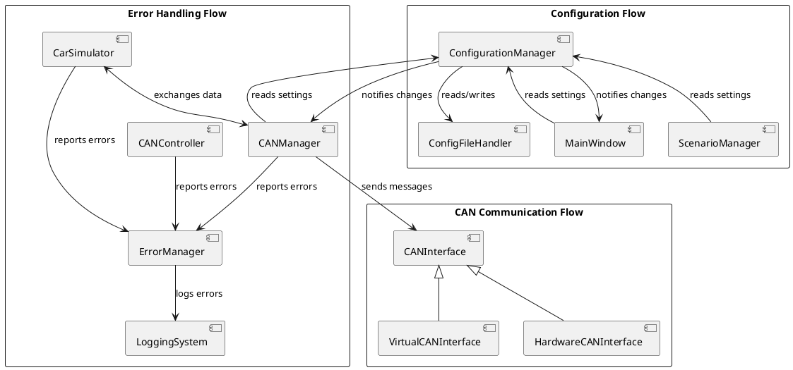

# Architecture Overview

The TFItPiCAN architecture follows a modular design with clear separation of concerns. The system is divided into several interconnected packages, each responsible for a specific aspect of functionality.

## High-Level Architecture Diagram

## Key Component Relationships

## Design Patterns

The TFItPiCAN architecture incorporates several design patterns to enhance maintainability and extensibility:

1. **Factory Pattern** - Used for creating appropriate CAN interface implementations based on platform detection
2. **Observer Pattern** - Used for event notification, particularly in the `MessageObserver` interface
3. **Strategy Pattern** - Used in the `CANFilterRule` for flexible message filtering
4. **Abstract Factory** - Used for creating scenario instances
5. **Command Pattern** - Used in the UI for handling user actions
6. **Adapter Pattern** - Used for interfacing with different CAN hardware implementations

## Interface Abstractions

The design emphasizes interface-based programming to improve flexibility and testability:

1. **CANInterface** - Abstract interface for CAN communication
2. **ScenarioUI** - Interface for scenario management UI components
3. **LoggingInterface** - Interface for logging operations
4. **ErrorPropagationInterface** - Interface for error handling
5. **ConfigurationInterface** - Interface for configuration management

These abstractions allow for alternative implementations and facilitate mock objects for testing.

## Cross-Cutting Concerns

Several aspects of the system cut across multiple components:

1. **Error Handling** - Centralized through the `ErrorManager`
2. **Logging** - Provided by the `LoggingSystem`
3. **Configuration** - Managed by the `ConfigurationManager`
4. **Localization** - Handled by the `LocalizationManager`

These cross-cutting concerns are implemented as separate services that can be accessed by any component in the system.

## Package Dependencies

The dependencies between packages are designed to minimize coupling:

- **GUI Layer** depends on Business Logic layer but not vice versa
- **Business Logic** depends on Hardware Abstraction but not vice versa
- **Cross-cutting concerns** are accessed by all layers
- **Testing components** depend on all other components for testing purposes

This layered approach ensures changes in one area have minimal impact on other areas of the system.
