# Package Documentation

This chapter provides detailed documentation for each package in the TFItPiCAN system, including class diagrams, component descriptions, and relationships.

## Table of Contents - Packages

1. [can_bus_support](#can_bus_support-package)
2. [tfitpican_simulator](#tfitpican_simulator-package)
3. [scenarios](#scenarios-package)
4. [scenario_ui](#scenario_ui-package)
5. [logging](#logging-package)
6. [user_management](#user_management-package)
7. [gui](#gui-package)
8. [localization](#localization-package)
9. [error_handling](#error_handling-package)
10. [configuration_management](#configuration_management-package)
11. [testing](#testing-package)
12. [documentation](#documentation-package)

## can_bus_support Package

This package handles the core CAN bus functionality, including message filtering, interpretation, and bus configuration.

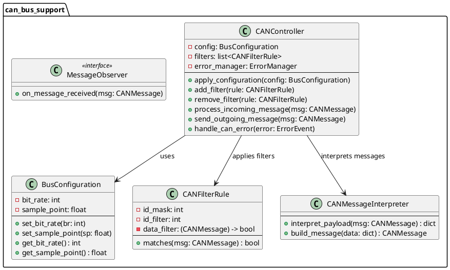

### BusConfiguration

Handles configuration parameters for the CAN bus communication.

**Attributes:**
- `bit_rate`: int - The bit rate of the CAN bus communication
- `sample_point`: float - The sample point for the CAN bus communication

**Methods:**
- `set_bit_rate(br: int)` - Sets the bit rate
- `set_sample_point(sp: float)` - Sets the sample point
- `get_bit_rate() : int` - Returns the current bit rate
- `get_sample_point() : float` - Returns the current sample point

### CANController

Central component that manages CAN message processing by applying filters and handling both incoming and outgoing messages.

**Attributes:**
- `config`: BusConfiguration - Configuration for the CAN bus
- `filters`: list<CANFilterRule> - List of filter rules to apply to messages
- `error_manager`: ErrorManager - Handles and propagates errors

**Methods:**
- `apply_configuration(config: BusConfiguration)` - Applies a new bus configuration
- `add_filter(rule: CANFilterRule)` - Adds a new filter rule
- `remove_filter(rule: CANFilterRule)` - Removes an existing filter rule
- `process_incoming_message(msg: CANMessage)` - Processes a received message
- `send_outgoing_message(msg: CANMessage)` - Sends a message to the CAN bus
- `handle_can_error(error: ErrorEvent)` - Handles CAN-related errors

### CANFilterRule

Defines filtering rules for CAN messages, allowing selective processing.

**Attributes:**
- `id_mask`: int - Mask to apply to message IDs for filtering
- `id_filter`: int - Value to compare against masked message IDs
- `data_filter`: (CANMessage) -> bool - Optional function for data-based filtering

**Methods:**
- `matches(msg: CANMessage) : bool` - Determines if a message matches the filter

### CANMessageInterpreter

Converts between raw CAN message payloads and structured data dictionaries.

**Methods:**
- `interpret_payload(msg: CANMessage) : dict` - Converts a CAN message payload to a data dictionary
- `build_message(data: dict) : CANMessage` - Creates a CAN message from a data dictionary

### MessageObserver (Interface)

Interface for components that need to observe and react to incoming CAN messages.

**Methods:**
- `on_message_received(msg: CANMessage)` - Called when a new message is received

## tfitpican_simulator Package

This package contains the simulation components for vehicle behavior and CAN communication interfaces.

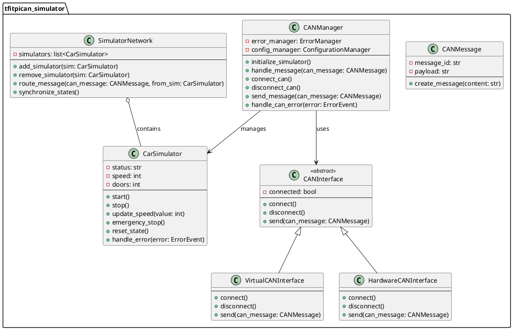

### CarSimulator

Simulates a vehicle, maintaining state (speed, door status, etc.) and handling errors.

**Attributes:**
- `status`: str - Current status of the simulated car
- `speed`: int - Current speed of the simulated car
- `doors`: int - Current state of doors (locked/unlocked)

**Methods:**
- `start()` - Starts the simulator
- `stop()` - Stops the simulator
- `update_speed(value: int)` - Updates the simulated car's speed
- `emergency_stop()` - Simulates an emergency stop
- `reset_state()` - Resets the simulator state
- `handle_error(error: ErrorEvent)` - Handles simulator-related errors

### CANMessage

Represents a CAN message with a unique identifier and associated payload.

**Attributes:**
- `message_id`: str - Identifier for the message
- `payload`: str - Data payload of the message

**Methods:**
- `create_message(content: str)` - Creates a new message with the specified content

### CANInterface (Abstract)

Defines the common interface for both hardware and virtual CAN implementations.

**Attributes:**
- `connected`: bool - Connection status of the interface

**Methods:**
- `connect()` - Establishes connection
- `disconnect()` - Terminates connection
- `send(can_message: CANMessage)` - Sends a message through the interface

### VirtualCANInterface

A simulated CAN interface used for testing and simulation purposes.

**Methods:**
- `connect()` - Simulates connecting to a virtual CAN bus
- `disconnect()` - Simulates disconnecting from a virtual CAN bus
- `send(can_message: CANMessage)` - Simulates sending a CAN message

### HardwareCANInterface

Implements the CAN interface for hardware-based operations, connecting to actual CAN hardware.

**Methods:**
- `connect()` - Connects to the physical CAN hardware
- `disconnect()` - Disconnects from the physical CAN hardware
- `send(can_message: CANMessage)` - Sends a message through the physical CAN interface

### CANManager

Coordinates CAN communications between simulators and CAN interfaces, integrating error and configuration management.

**Attributes:**
- `error_manager`: ErrorManager - For error handling
- `config_manager`: ConfigurationManager - For CAN configuration

**Methods:**
- `initialize_simulator()` - Sets up the simulation environment
- `handle_message(can_message: CANMessage)` - Processes incoming CAN messages
- `connect_can()` - Establishes a CAN connection
- `disconnect_can()` - Terminates the CAN connection
- `send_message(can_message: CANMessage)` - Sends a message to the CAN bus
- `handle_can_error(error: ErrorEvent)` - Handles CAN-related errors

### SimulatorNetwork

Manages a collection of simulators, routing messages among them and synchronizing their states.

**Attributes:**
- `simulators`: list<CarSimulator> - List of connected simulators

**Methods:**
- `add_simulator(sim: CarSimulator)` - Adds a simulator to the network
- `remove_simulator(sim: CarSimulator)` - Removes a simulator from the network
- `route_message(can_message: CANMessage, from_sim: CarSimulator)` - Routes messages between simulators
- `synchronize_states()` - Ensures all simulators have consistent states

## scenarios Package

This package provides various simulation scenarios and management of these scenarios.

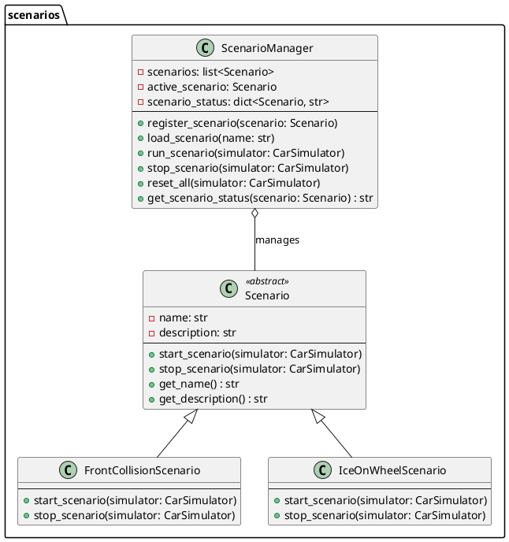

### Scenario (Abstract)

Abstract base class for simulation scenarios.

**Attributes:**
- `name`: str - Name of the scenario
- `description`: str - Description of the scenario

**Methods:**
- `start_scenario(simulator: CarSimulator)` - Initiates the scenario
- `stop_scenario(simulator: CarSimulator)` - Stops the scenario
- `get_name() : str` - Returns the scenario name
- `get_description() : str` - Returns the scenario description

### FrontCollisionScenario

Simulates a front collision scenario.

**Methods:**
- `start_scenario(simulator: CarSimulator)` - Starts the front collision scenario
- `stop_scenario(simulator: CarSimulator)` - Stops the front collision scenario

### IceOnWheelScenario

Simulates a scenario where ice causes a loss of traction.

**Methods:**
- `start_scenario(simulator: CarSimulator)` - Starts the ice on wheel scenario
- `stop_scenario(simulator: CarSimulator)` - Stops the ice on wheel scenario

### ScenarioManager

Manages the registration, execution, and status of simulation scenarios.

**Attributes:**
- `scenarios`: list<Scenario> - Available scenarios
- `active_scenario`: Scenario - Currently active scenario
- `scenario_status`: dict<Scenario, str> - Status of each scenario (Running, Stopped, etc.)

**Methods:**
- `register_scenario(scenario: Scenario)` - Adds a scenario to the manager
- `load_scenario(name: str)` - Loads a scenario by name
- `run_scenario(simulator: CarSimulator)` - Executes the active scenario
- `stop_scenario(simulator: CarSimulator)` - Stops the active scenario
- `reset_all(simulator: CarSimulator)` - Resets all scenarios
- `get_scenario_status(scenario: Scenario) : str` - Gets the status of a scenario

## scenario_ui Package

This package provides the user interface components for interacting with scenarios.

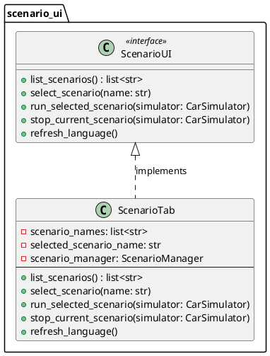

### ScenarioUI (Interface)

Interface for user interface components that manage scenarios.

**Methods:**
- `list_scenarios() : list<str>` - Lists available scenarios
- `select_scenario(name: str)` - Selects a scenario by name
- `run_selected_scenario(simulator: CarSimulator)` - Executes the selected scenario
- `stop_current_scenario(simulator: CarSimulator)` - Stops the current scenario
- `refresh_language()` - Updates UI language based on localization settings

### ScenarioTab

A concrete implementation of the ScenarioUI interface for a tabbed interface.

**Attributes:**
- `scenario_names`: list<str> - Names of available scenarios
- `selected_scenario_name`: str - Currently selected scenario
- `scenario_manager`: ScenarioManager - Reference to the scenario manager

**Methods:**
- `list_scenarios() : list<str>` - Lists available scenarios
- `select_scenario(name: str)` - Selects a scenario by name
- `run_selected_scenario(simulator: CarSimulator)` - Runs the selected scenario
- `stop_current_scenario(simulator: CarSimulator)` - Stops the current scenario
- `refresh_language()` - Updates the tab's language

## logging Package

This package provides logging functionality for the system.

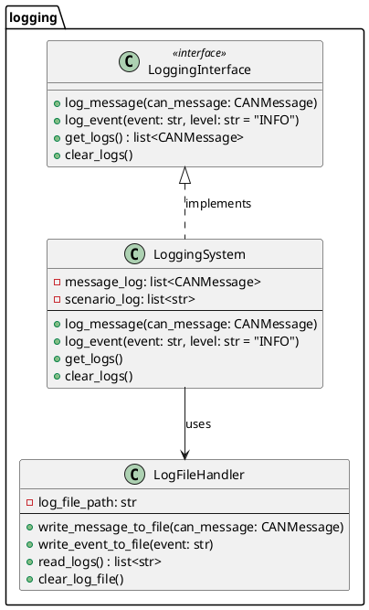

### LoggingInterface (Interface)

Interface that defines the operations for logging systems.

**Methods:**
- `log_message(can_message: CANMessage)` - Logs a CAN message
- `log_event(event: str, level: str = "INFO")` - Logs an event with a specified level
- `get_logs() : list<CANMessage>` - Retrieves logged messages
- `clear_logs()` - Clears the logs

### LoggingSystem

Centralized logging system implementing the LoggingInterface.

**Attributes:**
- `message_log`: list<CANMessage> - Log of CAN messages
- `scenario_log`: list<str> - Log of scenario events

**Methods:**
- `log_message(can_message: CANMessage)` - Logs a CAN message
- `log_event(event: str, level: str = "INFO")` - Logs an event
- `get_logs()` - Retrieves all logs
- `clear_logs()` - Clears all logs

### LogFileHandler

Handles file I/O for logging purposes.

**Attributes:**
- `log_file_path`: str - Path to the log file

**Methods:**
- `write_message_to_file(can_message: CANMessage)` - Writes a message to the log file
- `write_event_to_file(event: str)` - Writes an event to the log file
- `read_logs() : list<str>` - Reads logs from the file
- `clear_log_file()` - Clears the log file

## user_management Package

This package handles user authentication and role-based access control.

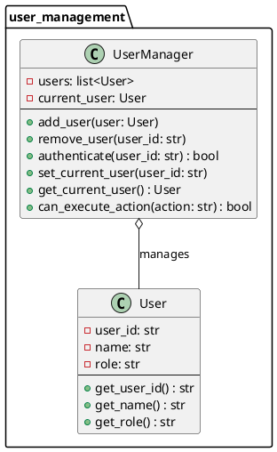

### User

Represents a user in the system.

**Attributes:**
- `user_id`: str - Unique identifier for the user
- `name`: str - User's display name
- `role`: str - User's role in the system

**Methods:**
- `get_user_id() : str` - Returns the user's ID
- `get_name() : str` - Returns the user's name
- `get_role() : str` - Returns the user's role

### UserManager

Handles user authentication and session management.

**Attributes:**
- `users`: list<User> - List of registered users
- `current_user`: User - Currently active user

**Methods:**
- `add_user(user: User)` - Adds a new user
- `remove_user(user_id: str)` - Removes a user
- `authenticate(user_id: str) : bool` - Authenticates a user
- `set_current_user(user_id: str)` - Sets the active user
- `get_current_user() : User` - Gets the active user
- `can_execute_action(action: str) : bool` - Checks if the current user can perform an action

## gui Package

This package provides the graphical user interface components.

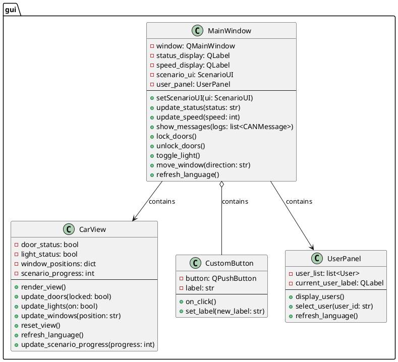

### MainWindow

The primary graphical interface that integrates system components.

**Attributes:**
- `window`: QMainWindow - Qt main window
- `status_display`: QLabel - Display for status information
- `speed_display`: QLabel - Display for speed information
- `scenario_ui`: ScenarioUI - Interface for scenario management
- `user_panel`: UserPanel - Panel for user information

**Methods:**
- `setScenarioUI(ui: ScenarioUI)` - Sets the scenario UI component
- `update_status(status: str)` - Updates the status display
- `update_speed(speed: int)` - Updates the speed display
- `show_messages(logs: list<CANMessage>)` - Displays log messages
- `lock_doors()` - Locks simulated doors
- `unlock_doors()` - Unlocks simulated doors
- `toggle_light()` - Toggles simulated lights
- `move_window(direction: str)` - Moves simulated windows
- `refresh_language()` - Updates UI language

### CarView

Displays car status including door and light status.

**Attributes:**
- `door_status`: bool - Current door status (locked/unlocked)
- `light_status`: bool - Current light status (on/off)
- `window_positions`: dict - Positions of the windows
- `scenario_progress`: int - Progress of the active scenario

**Methods:**
- `render_view()` - Renders the car view
- `update_doors(locked: bool)` - Updates the door status
- `update_lights(on: bool)` - Updates the light status
- `update_windows(position: str)` - Updates the window positions
- `reset_view()` - Resets the view to default
- `refresh_language()` - Updates the view's language
- `update_scenario_progress(progress: int)` - Updates the scenario progress display

### CustomButton

Represents a customizable button within the GUI.

**Attributes:**
- `button`: QPushButton - Qt button widget
- `label`: str - Text label for the button

**Methods:**
- `on_click()` - Handles click events
- `set_label(new_label: str)` - Sets the button label

### UserPanel

Manages and displays user information on the GUI.

**Attributes:**
- `user_list`: list<User> - List of users to display
- `current_user_label`: QLabel - Label showing the current user

**Methods:**
- `display_users()` - Shows the list of users
- `select_user(user_id: str)` - Selects a user
- `refresh_language()` - Updates the panel's language

## localization Package

This package handles multi-language support.

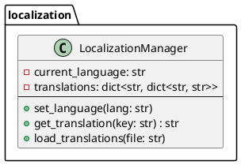

### LocalizationManager

Handles multi-language support and translation retrieval.

**Attributes:**
- `current_language`: str - Currently active language
- `translations`: dict<str, dict<str, str>> - Mapping of keys to translations

**Methods:**
- `set_language(lang: str)` - Sets the active language
- `get_translation(key: str) : str` - Gets a translation for a key
- `load_translations(file: str)` - Loads translations from a file

## error_handling Package

This package provides error handling and propagation functionality.

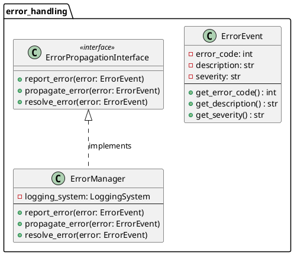

### ErrorEvent

Encapsulates error details, including error code, description, and severity.

**Attributes:**
- `error_code`: int - Unique identifier for the error
- `description`: str - Description of the error
- `severity`: str - Severity level (INFO, WARNING, ERROR, CRITICAL)

**Methods:**
- `get_error_code() : int` - Returns the error code
- `get_description() : str` - Returns the error description
- `get_severity() : str` - Returns the error severity

### ErrorPropagationInterface (Interface)

Defines operations for reporting, propagating, and resolving errors.

**Methods:**
- `report_error(error: ErrorEvent)` - Reports an error
- `propagate_error(error: ErrorEvent)` - Propagates an error to other components
- `resolve_error(error: ErrorEvent)` - Marks an error as resolved

### ErrorManager

Implements the ErrorPropagationInterface to centralize error handling.

**Attributes:**
- `logging_system`: LoggingSystem - Reference to the logging system

**Methods:**
- `report_error(error: ErrorEvent)` - Reports an error
- `propagate_error(error: ErrorEvent)` - Propagates an error to affected components
- `resolve_error(error: ErrorEvent)` - Resolves an error

## configuration_management Package

This package manages configuration settings for the system.

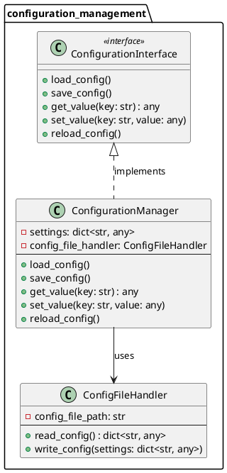

### ConfigurationInterface (Interface)

Defines the interface for managing configuration settings.

**Methods:**
- `load_config()` - Loads configuration from storage
- `save_config()` - Saves configuration to storage
- `get_value(key: str) : any` - Retrieves a configuration value by key
- `set_value(key: str, value: any)` - Sets a configuration value
- `reload_config()` - Reloads configuration at runtime

### ConfigurationManager

Manages configuration settings and supports dynamic reloads.

**Attributes:**
- `settings`: dict<str, any> - In-memory configuration settings
- `config_file_handler`: ConfigFileHandler - Handler for configuration file I/O

**Methods:**
- `load_config()` - Loads configuration from file
- `save_config()` - Saves configuration to file
- `get_value(key: str) : any` - Gets a configuration value
- `set_value(key: str, value: any)` - Sets a configuration value
- `reload_config()` - Reloads configuration at runtime

### ConfigFileHandler

Handles reading from and writing to configuration files.

**Attributes:**
- `config_file_path`: str - Path to the configuration file

**Methods:**
- `read_config() : dict<str, any>` - Reads configuration from file
- `write_config(settings: dict<str, any>)` - Writes configuration to file

## testing Package

This package provides testing infrastructure for the system.

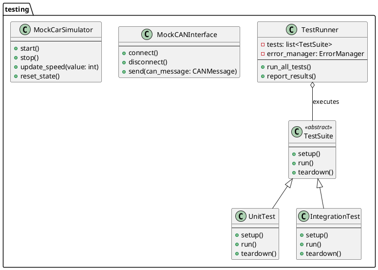

### TestRunner

Runs test suites and reports test results.

**Attributes:**
- `tests`: list<TestSuite> - Test suites to run
- `error_manager`: ErrorManager - For handling test errors

**Methods:**
- `run_all_tests()` - Executes all test suites
- `report_results