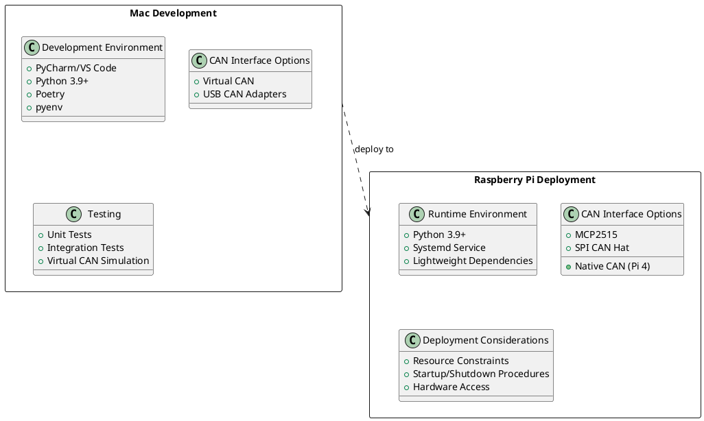

# Cross-Platform Considerations

TFItPiCAN is designed to be developed on Mac and deployed on Raspberry Pi. This chapter outlines important considerations for ensuring compatibility across platforms.

## Architecture Differences

- **Mac**: x86_64/ARM64 (Apple Silicon)
- **Raspberry Pi**: ARM architecture (32-bit or 64-bit depending on model)

When developing on Mac for Raspberry Pi deployment, be aware of these architecture-specific considerations:

### Python Version Compatibility

For cross-platform development:

1. **Python Version**
   - Use Python 3.9+ which is available on both platforms
   - Test with the exact Python version that will be used on the Raspberry Pi
   - Use pyenv to manage Python versions during development

2. **Environment Management**
   - Use Poetry for dependency management across platforms
   - Create a specific `pyproject.toml` that works for both Mac and Raspberry Pi
   - Pin dependency versions to ensure consistent behavior

3. **Package Selection**
   - Use packages that are compatible with both platforms
   - Avoid packages with platform-specific C extensions where possible
   - Test all dependencies on Raspberry Pi before extensive development

## Hardware Access

### CAN Bus Hardware

TFItPiCAN must support different CAN hardware interfaces on Mac (development) and Raspberry Pi (deployment):

1. **Hardware Abstraction**
   - The `HardwareCANInterface` implementation will be platform-specific
   - Use python-can as the foundation for cross-platform CAN access
   - Create factory methods that instantiate the appropriate interface based on platform detection

2. **Mac Development**
   - During development, primarily use `VirtualCANInterface` for testing
   - For hardware testing on Mac, support common USB CAN adapters
   - Document the specific CAN hardware supported on Mac

3. **Raspberry Pi Deployment**
   - Support standard Raspberry Pi CAN interfaces (MCP2515, etc.)
   - Create detailed setup instructions for Raspberry Pi CAN hardware
   - Include configuration scripts for different Raspberry Pi CAN options

## Performance Optimization

The performance characteristics differ significantly between Mac development machines and Raspberry Pi target hardware:

1. **Resource Management**
   - Raspberry Pi has limited CPU, memory, and storage compared to Mac
   - Design the application to run efficiently on Raspberry Pi's constraints
   - Implement proper resource cleanup and memory management

2. **GUI Performance**
   - Optimize UI rendering for lower-performance hardware
   - Use lightweight UI components when possible
   - Consider implementing a headless option for performance-critical deployments

3. **Profiling and Optimization**
   - Profile application performance on Raspberry Pi
   - Identify and optimize bottlenecks specific to Raspberry Pi
   - Test with representative load on target hardware



## File System Differences

Mac and Raspberry Pi use different file system layouts and conventions:

1. **Path Handling**
   - Use platform-independent path handling (e.g., Python's `pathlib`)
   - Handle different file system locations between platforms
   - Store user data and configurations in platform-appropriate locations

2. **Configuration Storage**
   - Mac: `~/Library/Application Support/TFItPiCAN/`
   - Raspberry Pi: `/etc/tfitpican/` or `/home/pi/.config/tfitpican/`
   - Use the `appdirs` package to determine appropriate directories

3. **File Permissions**
   - Respect different permission models between macOS and Linux
   - Use appropriate permission settings for configuration and log files
   - Handle potential permission issues when accessing hardware on Raspberry Pi

## Deployment Strategy

For efficient deployment from Mac to Raspberry Pi:

1. **Deployment Automation**
   - Create deployment scripts that package and transfer application code
   - Use SSH for secure deployment to Raspberry Pi
   - Include configuration and dependency setup in deployment process

2. **Continuous Testing**
   - Set up CI/CD to test on both Mac and Raspberry Pi
   - Use Docker containers to simulate Raspberry Pi environment on Mac
   - Create hardware-in-the-loop testing for final validation

3. **Update Management**
   - Design an update mechanism for deployed systems
   - Implement configuration backup and restore during updates
   - Provide rollback capabilities for failed updates

## Environment Setup Guide

### Mac Development Environment

```bash
# Install pyenv and poetry
brew install pyenv
curl -sSL https://install.python-poetry.org | python3 -

# Install Python version that matches Raspberry Pi
pyenv install 3.9.7
pyenv global 3.9.7

# Create project with Poetry
mkdir TFItPiCAN
cd TFItPiCAN
pyenv local 3.9.7
poetry init

# Add dependencies
poetry add python-can pyqt6 pyyaml appdirs
poetry add --dev pytest pytest-cov flake8 mypy

# Create virtual environment and activate
poetry shell
```

### Raspberry Pi Setup

```bash
# Install required packages
sudo apt-get update
sudo apt-get install -y python3-pip python3-venv

# Install CAN interface dependencies
sudo apt-get install -y can-utils

# Set up CAN interface (example for MCP2515)
sudo ip link set can0 up type can bitrate 500000

# Create Python environment
python3 -m venv venv
source venv/bin/activate

# Install dependencies
pip install -r requirements.txt

# Set up as service
sudo cp tfitpican.service /etc/systemd/system/
sudo systemctl enable tfitpican
sudo systemctl start tfitpican
```

## Testing Across Platforms

To ensure compatibility across platforms, implement these testing strategies:

1. **Unit Tests**
   - Create platform-agnostic unit tests
   - Mock hardware dependencies for consistent testing
   - Run tests on both Mac and Raspberry Pi

2. **Integration Tests**
   - Test component interactions on both platforms
   - Create lightweight integration tests for Raspberry Pi
   - Use platform detection to adapt tests as needed

3. **System Tests**
   - Perform end-to-end testing on actual hardware
   - Create automated system test scenarios
   - Validate performance metrics on target platform
