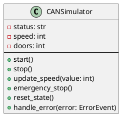

# CANSimulator

- **Author:** Thomas Fischer
- **Version:** 0.1.0
- **Filename:** can_simulator.py
- **Filetype:** Python
- **Description:** Manages CAN-Bus message generation and simulation controls

## Overview

The `CANSimulator` class is responsible for starting, pausing, and accelerating CAN-Bus message simulation. It can work with either real hardware or a virtual CAN device.

## Class Diagram



## Relationships

`CANSimulator` interacts with the following classes:

- **CANManager**: The CANManager coordinates between the CANSimulator and the CAN interfaces
- **LoggingSystem**: The CANSimulator logs simulation events through the LoggingSystem
- **ConfigurationManager**: Reads/writes simulation settings
- **ErrorManager**: Propagates errors that occur during simulation

## Methods

### start()

Starts the CAN bus simulation.

**Parameters:** None

**Returns:** None

**Example:**
```python
simulator = CANSimulator()
simulator.start()  # Begins CAN message generation
```

### stop()

Stops the CAN bus simulation.

**Parameters:** None

**Returns:** None

**Example:**
```python
simulator.stop()  # Halts CAN message generation
```

### update_speed(value: int)

Updates the simulation speed.

**Parameters:**
- `value` (int): The new speed value (1-100)

**Returns:** None

**Example:**
```python
simulator.update_speed(50)  # Sets simulation speed to 50%
```

### emergency_stop()

Immediately stops the simulation in case of emergency.

**Parameters:** None

**Returns:** None

**Example:**
```python
simulator.emergency_stop()  # Emergency halt of simulation
```

### reset_state()

Resets the simulator to its initial state.

**Parameters:** None

**Returns:** None

**Example:**
```python
simulator.reset_state()  # Reset simulator state
```

### handle_error(error: ErrorEvent)

Handles an error that occurred during simulation.

**Parameters:**
- `error` (ErrorEvent): The error event to handle

**Returns:** None

**Example:**
```python
error = ErrorEvent(code=101, description="CAN buffer overflow", severity="WARNING")
simulator.handle_error(error)  # Handle the error
```

## Configuration

The CANSimulator uses the following configuration settings from `config.yaml`:

```yaml
can_bus:
  simulation_speed: 1.0    # Default simulation speed multiplier
  message_interval: 0.5    # Time between messages (in seconds)
```

## Example Usage

```python
from tfitpican_simulator.can_simulator import CANSimulator
from error_handling.error_event import ErrorEvent

# Create a simulator instance
simulator = CANSimulator()

# Start the simulation
simulator.start()

# Change simulation speed
simulator.update_speed(75)

# Handle an error if it occurs
try:
    # Simulation operations
    pass
except Exception as e:
    error = ErrorEvent(code=500, description=str(e), severity="ERROR")
    simulator.handle_error(error)

# Stop the simulation when done
simulator.stop()
```

## Testing

The CANSimulator class can be tested using the MockCANInterface in the testing package:

```python
from testing.mock_can_interface import MockCANInterface
from tfitpican_simulator.can_simulator import CANSimulator

# Setup test
mock_interface = MockCANInterface()
simulator = CANSimulator()
simulator.set_interface(mock_interface)

# Run test
simulator.start()
assert mock_interface.is_connected() == True
```
