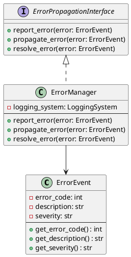

# ErrorManager

- **Author:** Thomas Fischer
- **Version:** 0.1.0
- **Filename:** error_manager.py
- **Filetype:** Python
- **Description:** Centralizes error handling, reporting, and propagation throughout the application

## Overview

The `ErrorManager` class provides a centralized system for handling, reporting, and propagating errors throughout the TFitPiCAN application. It implements the `ErrorPropagationInterface` to ensure consistent error handling across all components.

## Class Diagram



## Relationships

`ErrorManager` interacts with the following classes:

- **ErrorEvent**: Represents error information
- **LoggingSystem**: Records error events to logs
- **Various application components**: Receives error reports from and propagates errors to other components

## Methods

### report_error(error: ErrorEvent)

Reports an error that occurred in a component.

**Parameters:**
- `error` (ErrorEvent): The error event to report

**Returns:** None

**Example:**
```python
error = ErrorEvent(code=404, description="CAN device not found", severity="ERROR")
error_manager.report_error(error)
```

### propagate_error(error: ErrorEvent)

Propagates an error to affected components.

**Parameters:**
- `error` (ErrorEvent): The error event to propagate

**Returns:** None

**Example:**
```python
error = ErrorEvent(code=500, description="CAN buffer overflow", severity="CRITICAL")
error_manager.propagate_error(error)
```

### resolve_error(error: ErrorEvent)

Marks an error as resolved.

**Parameters:**
- `error` (ErrorEvent): The error event that has been resolved

**Returns:** None

**Example:**
```python
error = ErrorEvent(code=404, description="CAN device not found", severity="ERROR")
# After resolving the issue:
error_manager.resolve_error(error)
```

## Error Severity Levels

The ErrorManager uses the following severity levels:

- **INFO**: Informational messages that don't indicate a problem
- **WARNING**: Minor issues that don't prevent the application from functioning
- **ERROR**: Significant issues that prevent a feature from working properly
- **CRITICAL**: Severe issues that may cause the application to fail

## Error Codes

Error codes are organized by component:

- **100-199**: CAN interface errors
- **200-299**: Car simulator errors
- **300-399**: Scenario errors
- **400-499**: Configuration errors
- **500-599**: General system errors

## Example Usage

```python
from error_handling.error_manager import ErrorManager
from error_handling.error_event import ErrorEvent
from logging.logging_system import LoggingSystem

# Create a logging system
logging_system = LoggingSystem()

# Create an error manager
error_manager = ErrorManager(logging_system)

# Report an error
try:
    # Some operation that might fail
    can_device.connect()
except ConnectionError as e:
    error = ErrorEvent(
        code=101,
        description=f"Failed to connect to CAN device: {str(e)}",
        severity="ERROR"
    )
    error_manager.report_error(error)
    
    # Propagate the error to affected components
    error_manager.propagate_error(error)
    
# When the issue is fixed
error_manager.resolve_error(error)
```

## Integration with UI

The ErrorManager integrates with the UI to display error messages to the user:

```python
# In MainWindow class
def display_error(self, error: ErrorEvent):
    severity = error.get_severity()
    description = error.get_description()
    
    if severity == "WARNING":
        self.show_warning(description)
    elif severity == "ERROR" or severity == "CRITICAL":
        self.show_error(description)
```

## Custom Error Handlers

Components can register custom error handlers with the ErrorManager:

```python
def custom_can_error_handler(error: ErrorEvent):
    if error.get_error_code() in [101, 102, 103]:
        # Handle specific CAN errors
        can_manager.restart_connection()
        return True  # Error handled
    return False  # Error not handled

error_manager.register_handler("CAN", custom_can_error_handler)
```

## Testing

To test the ErrorManager, mock components can be created to verify error propagation:

```python
class MockComponent:
    def __init__(self):
        self.received_errors = []
        
    def on_error(self, error):
        self.received_errors.append(error)

# In a test
mock_component = MockComponent()
error_manager = ErrorManager(LoggingSystem())
error_manager.add_listener(mock_component.on_error)

error = ErrorEvent(code=500, description="Test error", severity="ERROR")
error_manager.propagate_error(error)

assert len(mock_component.received_errors) == 1
assert mock_component.received_errors[0].get_error_code() == 500
```
