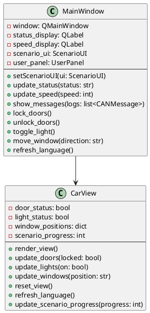

# MainWindow

- **Author:** Thomas Fischer
- **Version:** 0.1.0
- **Filename:** main_window.py
- **Filetype:** Python
- **Description:** Main application window with controls, status displays, and car visualization

## Overview

The `MainWindow` class is the primary GUI component of the TFitPiCAN application. It creates and manages the main application window, which includes controls for scenarios, status displays, a visual representation of the car, and a log display area. It uses PySide6 (Qt) for the GUI framework.

## Class Diagram



## Relationships

`MainWindow` interacts with the following classes:

- **CarView**: Visual representation of the car
- **ScenarioUI**: Interface for scenario selection and control
- **UserPanel**: Panel for user management in the UI
- **LoggingSystem**: Displays logs of CAN messages
- **UserManager**: Manages user authentication and sessions
- **ConfigurationManager**: Loads UI preferences
- **LocalizationManager**: Provides localized UI strings

## Methods

### setScenarioUI(ui: ScenarioUI)

Sets the ScenarioUI implementation to use.

**Parameters:**
- `ui` (ScenarioUI): The scenario UI implementation

**Returns:** None

**Example:**
```python
scenario_tab = ScenarioTab()
main_window.setScenarioUI(scenario_tab)
```

### update_status(status: str)

Updates the status display with the provided text.

**Parameters:**
- `status` (str): The status text to display

**Returns:** None

**Example:**
```python
main_window.update_status("Simulation running")
```

### update_speed(speed: int)

Updates the speed display with the provided value.

**Parameters:**
- `speed` (int): The speed value to display

**Returns:** None

**Example:**
```python
main_window.update_speed(65)
```

### show_messages(logs: list<CANMessage>)

Displays a list of CAN messages in the log area.

**Parameters:**
- `logs` (list<CANMessage>): A list of CAN messages to display

**Returns:** None

**Example:**
```python
main_window.show_messages(recent_logs)
```

### lock_doors()

Updates the UI to show doors in locked state.

**Parameters:** None

**Returns:** None

**Example:**
```python
main_window.lock_doors()
```

### unlock_doors()

Updates the UI to show doors in unlocked state.

**Parameters:** None

**Returns:** None

**Example:**
```python
main_window.unlock_doors()
```

### toggle_light()

Toggles the car lights in the UI.

**Parameters:** None

**Returns:** None

**Example:**
```python
main_window.toggle_light()
```

### move_window(direction: str)

Moves a car window in the specified direction.

**Parameters:**
- `direction` (str): The direction to move the window ("up" or "down")

**Returns:** None

**Example:**
```python
main_window.move_window("up")
```

### refresh_language()

Updates all UI elements with the current language strings.

**Parameters:** None

**Returns:** None

**Example:**
```python
main_window.refresh_language()
```

## UI Layout

The MainWindow has the following layout:

1. **Top Panel**:
   - Control buttons (start, pause, accelerate simulation)
   - Dropdown menus for scenario and language selection
   - User authentication controls

2. **Central Panel**:
   - Interactive car graphic (CarView)
   - Control buttons for car actions (lock/unlock doors, lights, windows)

3. **Lower Third**:
   - Real-time log display of CAN-Bus messages
   - Status and speed indicators

## Configuration

The MainWindow uses the following configuration settings from `config.yaml`:

```yaml
gui:
  theme: "light"
  window_size:
    width: 1024
    height: 768
```

## Example Usage

```python
from gui.main_window import MainWindow
from gui.car_view import CarView
from scenario_ui.scenario_tab import ScenarioTab
from logging.logging_system import LoggingSystem

# Create instances
logging_system = LoggingSystem()
car_view = CarView()
scenario_tab = ScenarioTab()
main_window = MainWindow()

# Set up connections
main_window.setScenarioUI(scenario_tab)

# Initialize and show the window
main_window.initialize()
main_window.show()

# Update UI based on events
main_window.update_status("Ready")
main_window.update_speed(0)

# Display logs
logs = logging_system.get_logs()
main_window.show_messages(logs)

# Interact with car features
main_window.lock_doors()
main_window.toggle_light()
```

## Localization

The MainWindow uses the LocalizationManager to provide multi-language support. All text displayed in the UI is loaded from language files. Example of English language strings:

```yaml
strings:
  welcome: "Welcome"
  start_button: "Start"
  pause_button: "Pause"
  accelerate_button: "Accelerate"
```

To update the UI language, call `refresh_language()` after changing the language in the LocalizationManager.
