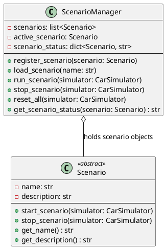

# ScenarioManager

- **Author:** Thomas Fischer
- **Version:** 0.1.0
- **Filename:** scenario_manager.py
- **Filetype:** Python
- **Description:** Coordinates and executes scenarios by interfacing with CAN simulation and car actions

## Overview

The `ScenarioManager` class is responsible for coordinating and executing scenarios that influence both the CAN-Bus simulation and car actions. It manages loading scenario configurations from YAML files, tracking scenario status, and delegating scenario actions to the appropriate components.

## Class Diagram



## Relationships

`ScenarioManager` interacts with the following classes:

- **Scenario**: The abstract base class for all scenarios
- **CarSimulator**: Interface to control car actions based on scenario steps
- **LoggingSystem**: Records scenario execution events
- **ConfigurationManager**: Loads configuration for scenarios
- **CarView**: Updates the visual representation of the car

## Methods

### register_scenario(scenario: Scenario)

Registers a scenario with the manager.

**Parameters:**
- `scenario` (Scenario): The scenario to register

**Returns:** None

**Example:**
```python
front_collision = FrontCollisionScenario()
scenario_manager.register_scenario(front_collision)
```

### load_scenario(name: str)

Loads a scenario by name from the available registered scenarios.

**Parameters:**
- `name` (str): The name of the scenario to load

**Returns:** bool: True if loaded successfully, False otherwise

**Example:**
```python
success = scenario_manager.load_scenario("Front Collision")
```

### run_scenario(simulator: CarSimulator)

Runs the currently loaded scenario using the provided simulator.

**Parameters:**
- `simulator` (CarSimulator): The car simulator instance to use

**Returns:** None

**Example:**
```python
scenario_manager.run_scenario(car_simulator)
```

### stop_scenario(simulator: CarSimulator)

Stops the currently running scenario.

**Parameters:**
- `simulator` (CarSimulator): The car simulator instance to use

**Returns:** None

**Example:**
```python
scenario_manager.stop_scenario(car_simulator)
```

### reset_all(simulator: CarSimulator)

Resets all scenarios and the simulator to their initial state.

**Parameters:**
- `simulator` (CarSimulator): The car simulator instance to use

**Returns:** None

**Example:**
```python
scenario_manager.reset_all(car_simulator)
```

### get_scenario_status(scenario: Scenario)

Gets the current status of a scenario.

**Parameters:**
- `scenario` (Scenario): The scenario to get status for

**Returns:** str: The status string (e.g., "Running", "Stopped", "Completed")

**Example:**
```python
status = scenario_manager.get_scenario_status(front_collision)
print(f"Scenario status: {status}")
```

## Configuration

The ScenarioManager uses scenario configuration files from the `scenarios/` directory. Example scenario file:

```yaml
meta:
  author: "Thomas Fischer"
  version: "0.1.0"
  description: "Scenario configuration for starting the car"
scenario:
  name: "Start Car"
  steps:
    - action: "start_engine"
      delay: 0
    - action: "display_message"
      message: "Engine started"
      delay: 1
```

## Example Usage

```python
from scenarios.scenario_manager import ScenarioManager
from scenarios.front_collision_scenario import FrontCollisionScenario
from tfitpican_simulator.car_simulator import CarSimulator

# Create instances
car_simulator = CarSimulator()
scenario_manager = ScenarioManager()

# Register scenarios
front_collision = FrontCollisionScenario()
scenario_manager.register_scenario(front_collision)

# Load a scenario
scenario_manager.load_scenario("Front Collision")

# Run the scenario
scenario_manager.run_scenario(car_simulator)

# Check scenario status
status = scenario_manager.get_scenario_status(front_collision)
print(f"Scenario status: {status}")

# Stop the scenario
scenario_manager.stop_scenario(car_simulator)

# Reset everything
scenario_manager.reset_all(car_simulator)
```

## Extending with New Scenarios

To add a new scenario:

1. Create a new class that extends the `Scenario` abstract base class.
2. Implement the required methods: `start_scenario`, `stop_scenario`.
3. Add a corresponding YAML configuration file in the `scenarios/` directory.
4. Register the new scenario with the ScenarioManager.

Example for a new scenario class:

```python
from scenarios.scenario import Scenario

class EmergencyBrakeScenario(Scenario):
    def __init__(self):
        super().__init__()
        self.name = "Emergency Brake"
        self.description = "Simulates emergency braking situation"
        
    def start_scenario(self, simulator):
        # Implement scenario start logic
        simulator.update_speed(100)  # Accelerate
        # Add delay
        simulator.emergency_stop()   # Emergency brake
        
    def stop_scenario(self, simulator):
        # Implement scenario stop logic
        simulator.reset_state()
```
