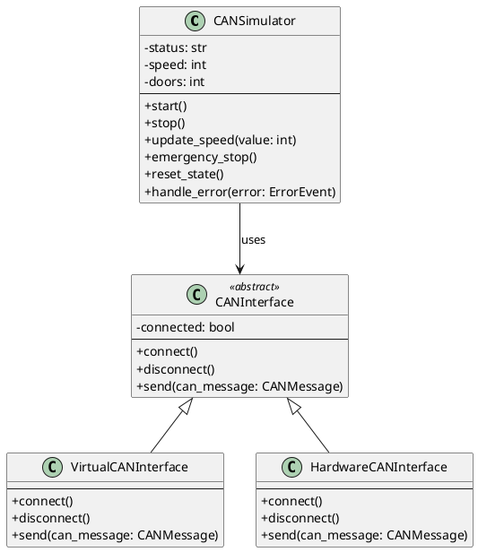
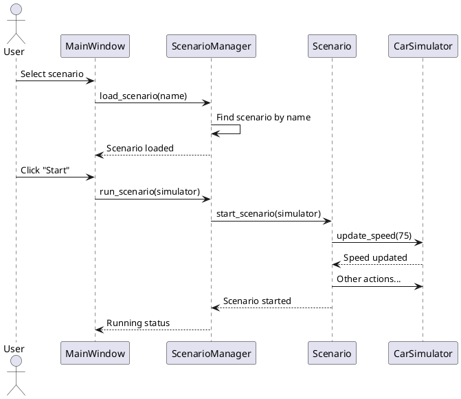
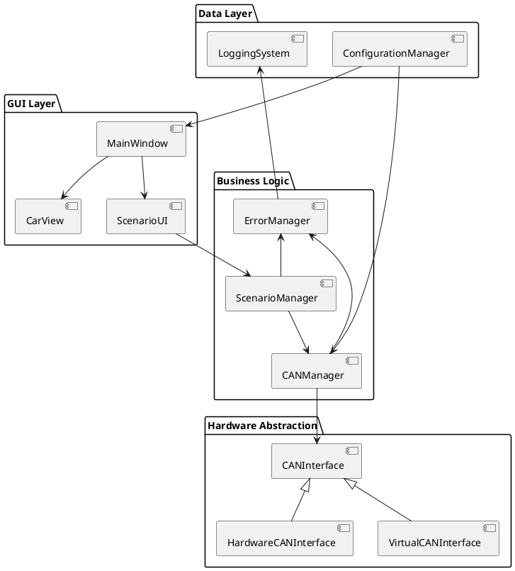

# Creating and Using UML Diagrams

- **Author:** Thomas Fischer
- **Version:** 0.1.0
- **Filename:** UML_DIAGRAMS_GUIDE.md
- **Filetype:** Markdown
- **Description:** Guide for creating and integrating UML diagrams in the TFitPiCAN project

## Overview

UML (Unified Modeling Language) diagrams are essential for visualizing the architecture and relationships in the TFitPiCAN project. This guide explains how to create, update, and integrate UML diagrams using PlantUML.

## Why PlantUML?

PlantUML offers several advantages for this project:

1. **Text-based**: Diagrams are defined in simple text files, making them easy to version control
2. **Comprehensive**: Supports all UML diagram types needed for this project
3. **Integration**: Works well with markdown documentation
4. **Open-source**: Free and widely supported

## Setting Up PlantUML

### Installation

1. **Install Java**: PlantUML requires Java to run
   ```bash
   # Ubuntu/Debian
   sudo apt install default-jre
   
   # macOS with Homebrew
   brew install openjdk
   ```

2. **Install Graphviz**: Required for rendering diagrams
   ```bash
   # Ubuntu/Debian
   sudo apt install graphviz
   
   # macOS with Homebrew
   brew install graphviz
   ```

3. **Download PlantUML JAR**:
   ```bash
   wget https://sourceforge.net/projects/plantuml/files/plantuml.jar/download -O plantuml.jar
   ```

### IDE Integration

For a better development experience, integrate PlantUML with your IDE:

- **VS Code**: Install the "PlantUML" extension by jebbs
- **PyCharm**: Install the "PlantUML integration" plugin
- **IntelliJ IDEA**: Install the "PlantUML integration" plugin

## Creating UML Diagrams

### Directory Structure

Store your PlantUML source files in a dedicated directory:

```
TFitPiCAN/
├── uml/
│   ├── class_diagrams/
│   │   ├── can_simulator.puml
│   │   ├── scenario_manager.puml
│   │   └── ...
│   ├── sequence_diagrams/
│   │   └── ...
│   └── component_diagrams/
│       └── ...
├── docs/
│   ├── images/
│   │   ├── can_simulator_class.png
│   │   ├── scenario_manager_class.png
│   │   └── ...
```

### Class Diagrams

Class diagrams show the structure of the system's classes, their attributes, methods, and relationships.

Create a file `uml/class_diagrams/can_simulator.puml`:



### Sequence Diagrams

Sequence diagrams show how objects interact in a particular scenario.

Create a file `uml/sequence_diagrams/scenario_execution.puml`:



### Component Diagrams

Component diagrams show how components are wired together.

Create a file `uml/component_diagrams/system_overview.puml`:



## Generating Diagram Images

### Command Line

Generate PNG images from PlantUML files:

```bash
java -jar plantuml.jar -tpng uml/class_diagrams/can_simulator.puml -o ../docs/images/
```

This will create `docs/images/can_simulator.png`.

### VS Code Integration

1. Open your .puml file in VS Code
2. Right-click and select "PlantUML: Export Current Diagram" 
3. Choose the format (PNG, SVG, etc.)
4. Select the destination folder (`docs/images/`)

## Including Diagrams in Documentation

Reference your UML diagrams in markdown documentation:

```markdown
# CANSimulator Class

## Class Diagram


## Description

The `CANSimulator` class is responsible for...
```

## UML Diagram Types to Use

For the TFitPiCAN project, focus on these diagram types:

1. **Class Diagrams**:
   - One diagram per main class showing its relationships
   - Package diagrams showing class groupings
   - Full system class diagram (use selectively as it can get complex)

2. **Sequence Diagrams**:
   - Scenario execution flow
   - Error handling flow
   - User interaction flow

3. **Component Diagrams**:
   - System architecture overview
   - Module relationships

4. **State Diagrams**:
   - Car simulator states
   - Scenario states

## Best Practices

1. **Keep Diagrams Focused**: Each diagram should illustrate a single concept
2. **Consistent Styling**: Use the same style for all diagrams
3. **Version Control**: Store `.puml` source files in Git
4. **Update Diagrams**: Keep diagrams in sync with code changes
5. **Use Notes**: Add explanatory notes to clarify complex parts

## Sample Styling

For consistent styling, use this header in your PlantUML files:

```plantuml
@startuml
skinparam handwritten false
skinparam monochrome false
skinparam shadowing false
skinparam defaultFontName "Arial"
skinparam defaultFontSize 12
skinparam roundCorner 5
skinparam dpi 100

' Class diagrams
skinparam class {
  BackgroundColor #F0F8FF
  BorderColor #2E8B57
  ArrowColor #2F4F4F
}

' Sequence diagrams
skinparam sequence {
  LifeLineBorderColor #2E8B57
  LifeLineBackgroundColor #F0F8FF
  ArrowColor #2F4F4F
}

' Other settings...
@enduml
```

## Integrating with GitHub Actions

Automate the generation of UML diagrams with GitHub Actions:

1. Create a file `.github/workflows/generate-uml.yml`:

```yaml
name: Generate UML Diagrams

on:
  push:
    paths:
      - 'uml/**/*.puml'
    branches: [ main ]

jobs:
  generate-uml:
    runs-on: ubuntu-latest
    
    steps:
    - uses: actions/checkout@v2
    
    - name: Generate PlantUML Diagrams
      uses: cloudbees/plantuml-github-action@master
      with:
        args: -v -tpng uml/**/*.puml -o docs/images/
    
    - name: Commit and push if changed
      run: |
        git config --global user.name 'GitHub Actions'
        git config --global user.email 'actions@github.com'
        git add docs/images/*.png
        git diff --quiet && git diff --staged --quiet || git commit -m "Update UML diagrams"
        git push
```

This workflow will automatically generate diagram images whenever you update the `.puml` files and commit them to the repository.

## Examples

See the `examples/` directory for complete diagram examples:

- [Class Diagram Example](examples/class_diagram_example.puml)
- [Sequence Diagram Example](examples/sequence_diagram_example.puml)
- [Component Diagram Example](examples/component_diagram_example.puml)
